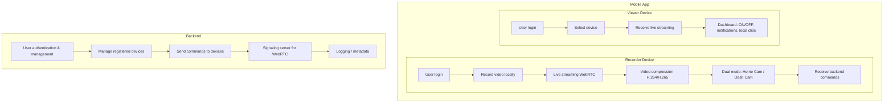

# HomeDriveCam Mobile App | Flutter

A cross-platform **Flutter** mobile application (iOS & Android) that can act as either a **home security camera** or a **dash cam**, depending on configuration. The app serves as both a **recorder** and **viewer**, allowing users to record video locally, stream live video in real-time, and remotely monitor and control registered devices with the same mobile application.

---

## Features

### Recorder (Device Side)

* Video recording on the mobile device (optional local storage)
* Live video streaming in real-time (WebRTC / RTSP)
* H.264 / H.265 video compression
* Dual mode: **Home Camera** or **Dash Cam**
* Receive commands from the backend (ON/OFF, configuration updates)

### Viewer (Mobile App)

* User authentication and login
* Select a device to view live stream
* Receive live streaming from recorder devices
* Dashboard with:

  * Remote ON/OFF control
  * Basic notifications
  * View locally recorded clips

### Backend (Lightweight Server)

* User management and authentication
* Manage registered recorder devices
* Send commands to recorders (ON/OFF, settings, updates)
* Signaling server for P2P WebRTC connection (stream initialization)
* Optional logging / metadata (video duration, battery status, device mode)

---

## Architecture

---

## Tech Stack

* **Mobile App:** Flutter (iOS & Android)
* **Video Streaming:** WebRTC / RTSP
* **Video Compression:** H.264 / H.265
* **Backend:** Spring Boot
